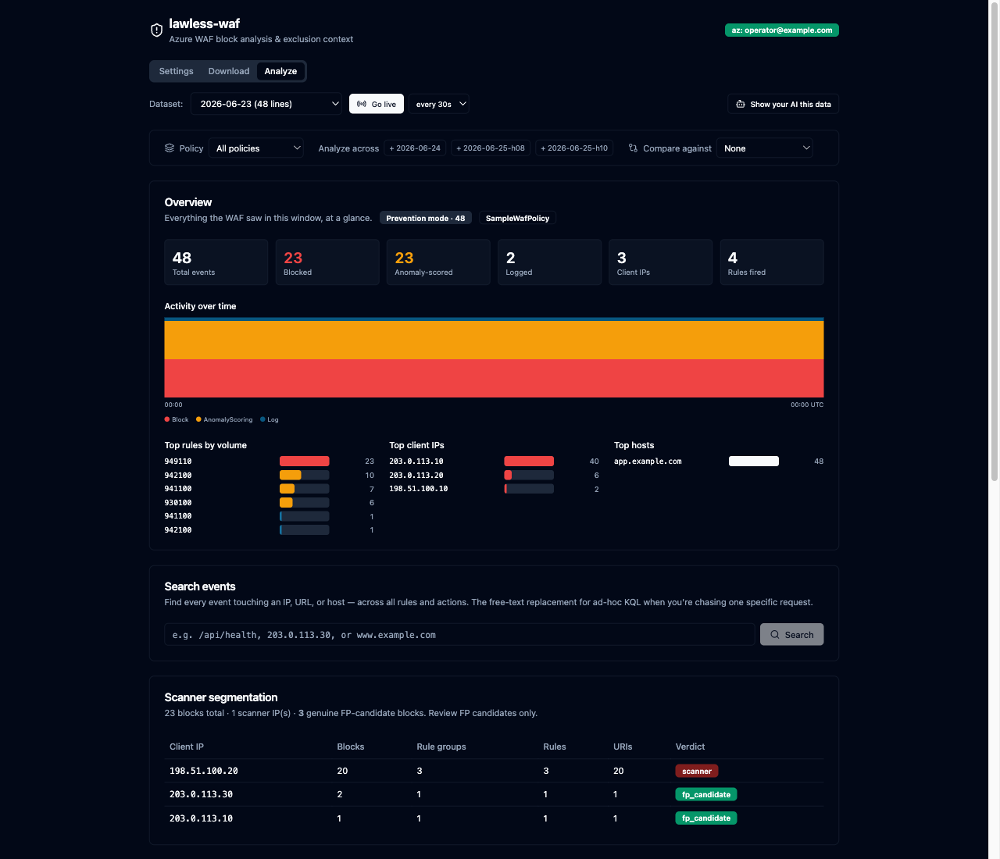
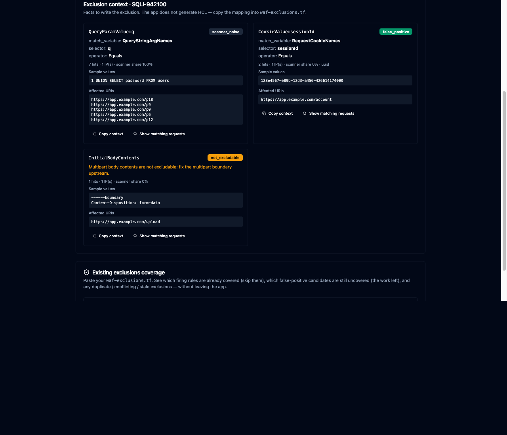
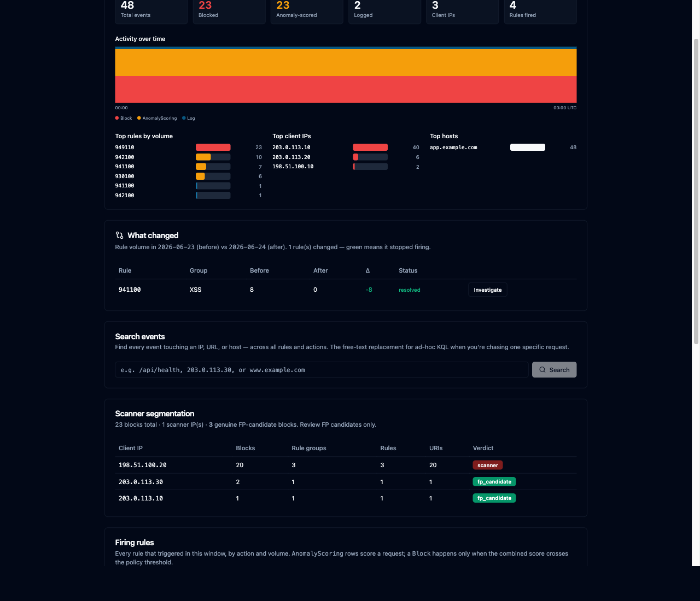
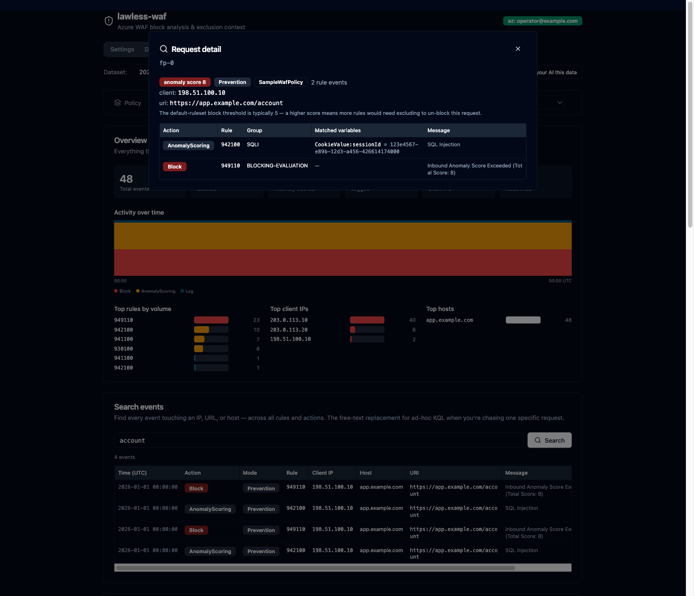
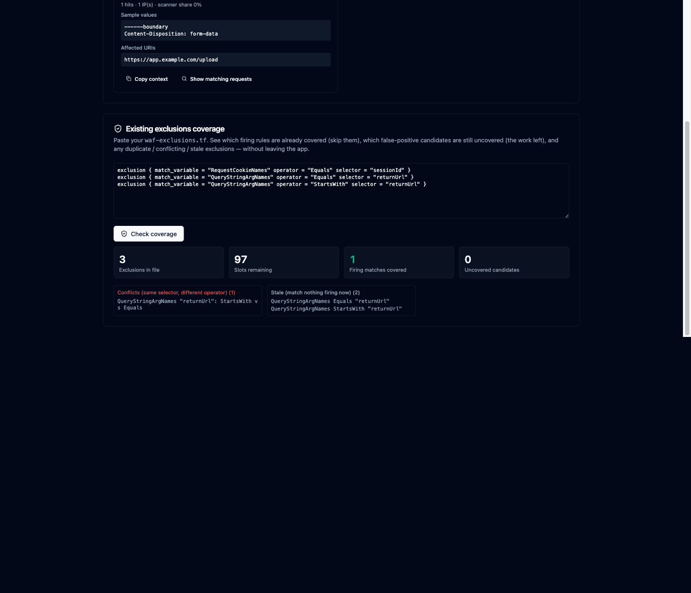

<div align="center">

# lawless-waf

### Tune Azure WAF false positives on your laptop, without paying Log Analytics prices.

[](https://github.com/mortennordbye/lawless-waf/actions/workflows/ci.yml) [](https://scorecard.dev/viewer/?uri=github.com/mortennordbye/lawless-waf) [](LICENSE) [](https://github.com/mortennordbye/lawless-waf/commits/main)

</div>

A small web app + local API for tuning Azure WAF false positives without paying Log
Analytics prices. It pulls the raw WAF log blobs your Front Door or Application Gateway
already archives to a storage account, queries them on your laptop with **DuckDB**,
separates vulnerability-scanner noise from genuine false positives, and hands you (or an AI
coding agent) the exact facts needed to write an exclusion in `waf-exclusions.tf`.

It does **not** generate Terraform. It returns structured context — rule id/group, the
`matchVariable` → Terraform `match_variable` + `selector` mapping, sample values, affected
URIs, hit counts, and a scanner/FP/attack classification — and I write the HCL myself (or
let the agent do it from those facts).

## Why I built it

WAF logs are noisy and high-volume, and the usual way to look at them is Log Analytics /
Sentinel with KQL. That works, but ingestion is billed per GB and it adds up fast for
something I only touch when I'm chasing a false positive. The logs are *already* being
archived to a storage account for retention, so I'm paying twice if I also ingest them just
to run a handful of queries.

This tool reads those archived blobs directly. DuckDB runs the queries locally, so the
analysis itself is free. Rough, list-price ballpark for ~5 GB/day of WAF logs (check the
Azure pricing calculator for your region and commitment tier — these are illustrative):

| | What it costs | Notes |
| --- | --- | --- |
| Log Analytics ingestion | ~$2.5–2.8 / GB ingested → **~$400+/month** for 150 GB | plus retention beyond the free period |
| Blob storage (the archive) | ~$0.02 / GB-month → **a few $/month** | you're usually already paying this |
| DuckDB queries (this tool) | **$0** | runs on your laptop against the blobs you downloaded |

So instead of ingesting everything into Log Analytics on the off chance I'll query it, I
download the day (or hour) I care about and query it locally. The trade-off is that this is
on-demand and single-operator, not a always-on SIEM — which is exactly what I want for
tuning work.

The other reason: the boring part of WAF tuning is *judgement* (is this a real attack or my
own app's traffic?), and the dangerous part is punching holes in the WAF for an attacker.
This tool front-loads scanner segmentation so a single noisy scanner IP can't trick you (or
an agent) into writing 30 exclusions for one attacker, and it keeps the whole loop —
find → classify → write → verify — in one place.

## Screenshots

(All screenshots use synthetic sample data — no real traffic.)

**Overview + scope.** Action mix, an activity timeline, top rules / IPs / hosts, and a scope
bar to filter by WAF policy or analyze several days at once.



**Exclusion context — the deliverable.** Per match variable: the Terraform `match_variable`
+ `selector`, a classification (false positive / scanner noise / not excludable), sample
values, and affected URIs.



**Before / after diff.** Compare two windows to confirm an exclusion actually stopped a rule
firing (`resolved`), or to spot a rule that just started.



**Full request inspector.** Every rule one request tripped, the matched variables, and the
anomaly score parsed from the blocking-evaluation message.



**Existing-exclusions coverage.** Paste your `waf-exclusions.tf` to see which firing rules
are already covered, what's still uncovered, and any duplicate / conflicting / stale entries.



## Quick start (offline, no Azure needed)

The only thing you need on your laptop is **Docker** — dependencies, tests, lint, the API,
and the UI all run in containers.

```bash
make up     # run it: API + web UI on http://localhost:5173 (hot reload)
make seed   # optional: generate a synthetic sample dataset for an offline trial
make test   # run the test suite
make e2e    # full offline pipeline test against the sample dataset
make        # list all commands
```

`.env` is created from `.env.example` on first run, and images build on first run. Open
**http://localhost:5173** and use the Settings / Download / Analyze tabs. There's no login —
the app binds to localhost and the real gate is Azure.

## Running against real Azure

The app never holds Azure secrets. It reuses your ambient `az` session, so on the host:

1. Sign in with `az login` (activate PIM and connect a VPN first if your storage account
   requires them).
2. Set `OFFLINE=false`.
3. On the **Settings** tab, pick the subscription → storage account → container. Once you're
   signed in those are dropdowns populated from your session. The default container is the
   Front Door WAF log name; for Application Gateway use
   `insights-logs-applicationgatewayfirewalllog`.
4. On **Download**, pick a date range (or "This hour"), check the size/time estimate, and
   pull the blobs. Cached days are reused.

`docker compose` mounts `~/.azure` into the container read-write so the CLI can refresh its
own token. No Azure credentials live in this repo.

## The workflow

1. **Download** the window you care about (a day, or a single hour for something recent).
2. **Analyze**:
   - Read **scanner segmentation** first — never write an exclusion for a scanner IP.
   - Look at **blocks by cause** (or firing rules, if the policy is in Detection mode and
     nothing actually blocks).
   - **Investigate** a rule to get its exclusion context, and drill into the real requests
     (URI / IP / host / matched value) to confirm it's a false positive.
   - Use **search** to chase one specific IP or URL across every rule, and the **request
     inspector** to see everything a single request tripped.
3. Check **coverage** against your existing `waf-exclusions.tf` so you don't redo work.
4. Write the exclusion from the returned `match_variable` + `selector` + operator.
5. After you apply the Terraform, **diff** a fresh window against the old one to confirm the
   rule stopped firing.

For near-real-time work, the Analyze tab has a **Go live** toggle that re-downloads the
current hour on a timer and refreshes the analysis in place. WAF diagnostic logs lag a few
minutes, so "live" tails with that inherent delay.

To hand the whole loop to an AI agent, use the MCP server below.

## Use it from an AI agent (MCP)

The agent drives the whole loop through native **MCP tools** — `refresh_live`,
`scanner_report`, `blocks_by_cause`, `exclusion_context`, `search`, `coverage`, `firing_diff`,
and friends (`src/lawless_waf/mcp_server.py`). The server reuses the same `service` layer as the
REST API and runs inside the app container (it has the dataset cache and your mounted `az`
session), speaking MCP over stdio. The app must be running (`make up`).

**Claude Code:**

```bash
make mcp   # claude mcp add lawless-waf -- docker compose -f <repo>/compose.yaml exec -T api python -m lawless_waf.mcp_server
```

**Any other client** (Cursor, Claude Desktop, Windsurf, …) — print the config and paste it into
that client's `mcpServers` config:

```bash
make mcp-config
```

It emits:

```json
{
  "mcpServers": {
    "lawless-waf": {
      "command": "docker",
      "args": ["compose", "-f", "/abs/path/to/compose.yaml", "exec", "-T", "api", "python", "-m", "lawless_waf.mcp_server"]
    }
  }
}
```

Then ask the agent to tune a window — it calls the tools directly. The server validates every
input at this boundary (it's no longer behind FastAPI's query validation) and the same scope
options apply: most tools take `dataset_id` plus optional `datasets=[…]` and `policy=…`.

## API (also what the UI calls)

Everything is under `/api` (no auth — localhost-only tool; Azure is the real gate). Every
analysis endpoint takes an optional scope: `?policy=<name>` restricts to one WAF policy, and
repeating `&dataset=<id>` analyzes several days together.

1. `GET/PUT /api/config` — the Azure target; `GET /api/azure/status` + the
   subscriptions / storage-accounts / containers lookups behind the Settings dropdowns.
2. `POST /api/datasets {date, hour?, force?}` — download a day/hour (cached; only calls Azure
   when missing). `POST /api/datasets/estimate` for size + ETA, `POST /api/datasets/speedtest`
   to measure real throughput, `DELETE /api/datasets[/{id}]` to clear cache.
3. `GET /api/datasets/{id}/summary` — overview (action mix, cardinalities, policy modes, top
   hosts/IPs, timeline). `GET …/policies`, `GET …/search?q=` (free-text drill),
   `GET …/requests/{trackingRef}` (one whole request + anomaly score).
4. `GET /api/datasets/{id}/scanner-report` — **read first**: scanners vs FP candidates.
5. `GET /api/datasets/{id}/blocks-by-cause?exclude_scanners=true` — what blocks real traffic.
6. `GET /api/datasets/{id}/rules/{ruleId}/exclusion-context` — the structured facts to write
   an exclusion; `…/events` for the row-level requests behind a rule.
7. `GET /api/datasets/{id}/diff?against=<id>` and `…/rules/{ruleId}/diff?against=<id>` —
   before/after, to verify a fix.
8. `POST /api/exclusions/count {tf_content}` — the 100-slot guard + consolidation hints;
   `POST /api/datasets/{id}/exclusions/coverage {tf_content}` — cross-reference an existing
   `waf-exclusions.tf` against what's firing now.

## Notes

- The app is meant to run on one operator's laptop. There's no app-level auth by design; the
  gate is your Azure access. Don't expose it on a network.
- Match values are truncated everywhere they're returned — WAF logs can carry tokens and PII.
- Coverage cross-references the top firing rules per run (it flags when it truncates) to stay
  fast on large datasets.

## Continuous integration

| Workflow | Trigger | Purpose |
| -------- | ------- | ------- |
| CI | push, PR | Python lint + test, frontend lint + build, Docker image build and push to GHCR |
| Dependency Review | PR | block PRs that add known-vulnerable dependencies |
| Scorecard | push, weekly | OpenSSF supply-chain grade → Security tab |
| Container Scan | push, weekly | Trivy image scan → Security tab |

## Architecture

- `src/lawless_waf/service.py` — framework-agnostic core, shared by the FastAPI routers and
  the MCP server (`mcp_server.py`) so both transports run identical logic.
- `duck/` — DuckDB engine (multi-file + policy-scoped views) and the runbook's queries.
- `analysis/` — `scanner.py` (IP segmentation), `classify.py` (attack vs app data),
  `mapping.py` (log → Terraform match variable), `exclusions.py` (slot guard + tf parsing).
- `azure/` — `downloader.py` / `estimate.py` (argv wrappers around the documented `az`
  commands), `discovery.py` (session + resource lookups).
- `api/` — thin FastAPI routers (rate limiting, boundary validation); all under `/api`.
- `frontend/` — React + Vite + Tailwind SPA; serves the UI and proxies `/api` to the API.

---

<div align="center">

### ⭐ Star this repo if you find it useful ⭐

<a href="https://www.star-history.com/#mortennordbye/lawless-waf&Date">
  <picture>
    <source media="(prefers-color-scheme: dark)" srcset="https://api.star-history.com/svg?repos=mortennordbye/lawless-waf&type=Date&theme=dark" />
    <source media="(prefers-color-scheme: light)" srcset="https://api.star-history.com/svg?repos=mortennordbye/lawless-waf&type=Date" />
    
  </picture>
</a>

Made by [Morten Victor Nordbye](https://nordbye.it/)

</div>
